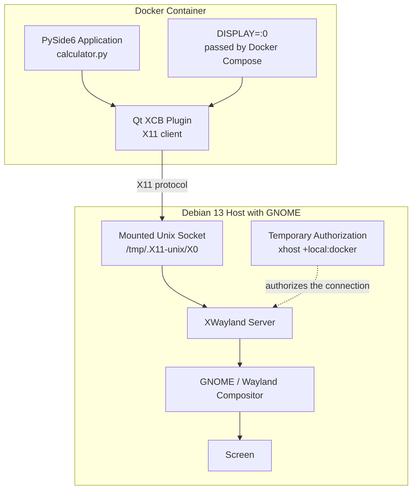

[Back to the main README](README.md)

# The `DISPLAY` Variable — Detailed Operation and Impact on This Project

This document provides an in-depth explanation of the `DISPLAY` environment variable, the X11 display system to which it provides access, and why it is required to display a Qt window from inside a Docker container.

---

## 1. X11: A Client/Server System — in the Opposite Direction to What You Might Expect

X11, also known as the X Window System version 11, is the historical display protocol used by Linux and Unix systems. Modern desktop environments such as GNOME now generally use Wayland while retaining XWayland for compatibility with applications that still communicate through the X11 protocol.

Its architecture follows a **client/server** model, but the terminology can initially appear counterintuitive:

* The **X server** is the program that manages the screen, keyboard, and mouse. It therefore runs on the **local machine** in front of the user.
* **X clients** are the applications that want to draw something on the screen, such as a web browser, a text editor, or this Qt calculator.

This apparent reversal is explained by the history of X11.

X11 was designed in the 1980s for distributed computing in academic and professional environments. The original idea was that an application could run on a powerful remote computer—the client consuming the computing resources—while displaying its interface on a lightweight local terminal.

The local terminal was called the server because it provided a display service to the applications requesting it. In this context, the word “server” refers to the component providing the graphical display, not to the machine running the application.

This project reuses the same mechanism, originally designed for networked systems more than 40 years ago, to establish communication between:

* the Docker container, acting as the X client and running `calculator.py`;
* the Debian GNOME desktop, providing the display service and showing the actual window.

---

## 2. Anatomy of the `DISPLAY` Variable

### 2.1 General Syntax

```text
DISPLAY=hostname:display.screen
```

| Component  | Purpose                                              | Typical value                     |
| ---------- | ---------------------------------------------------- | --------------------------------- |
| `hostname` | Machine hosting the X server to contact              | empty for a local connection      |
| `display`  | Instance number of the X server on that machine      | `0`                               |
| `screen`   | Physical screen number within that X server instance | usually omitted, with `0` implied |

### 2.2 Common Example

On a typical Debian/GNOME graphical session:

```bash
$ echo $DISPLAY
:0
```

This can be read as:

> X server number 0 on the local machine, using the default screen.

The colon at the beginning indicates that no hostname has been specified, which means that the connection is local.

### 2.3 Why Does the X Server Have a Number?

A single computer can theoretically run several X servers simultaneously, for example when several local graphical sessions are opened on different virtual terminals.

Each X server receives a distinct number:

```text
:0
:1
:2
```

This allows X clients to identify precisely which server they must communicate with.

### 2.4 The Historical Purpose of `screen`

Historically, a single machine could control several physical screens without combining them into one extended desktop.

Each physical screen could then have its own number:

```text
:0.0
:0.1
```

This use is now almost obsolete because modern multi-monitor configurations are generally managed as a unified desktop through technologies such as XRandR.

However, the `DISPLAY` syntax still preserves this historical structure.

---

## 3. The Physical Communication Channel: Unix Sockets

Knowing the value of `DISPLAY`, such as `:0`, is not enough by itself. The application also needs a physical communication channel through which it can reach the selected X server.

For a **local connection**, where the hostname is omitted, X11 uses a **Unix-domain socket**.

A Unix-domain socket is a special filesystem object used as a communication channel between processes running on the same machine. It avoids the conventional IP network stack and is generally more efficient than a local TCP connection.

The socket is conventionally located at:

```text
/tmp/.X11-unix/X<display_number>
```

For:

```text
DISPLAY=:0
```

the corresponding socket is:

```text
/tmp/.X11-unix/X0
```

The project’s `docker-compose.yml` file makes this socket directory accessible inside the container:

```yaml
volumes:
  - /tmp/.X11-unix:/tmp/.X11-unix:rw
```

Without this mount, the container would have no filesystem access to the host’s X11 socket, even if it knew the correct `DISPLAY` value. Docker’s filesystem isolation would prevent the application from reaching it.

In this configuration, `DISPLAY` and the socket mount are therefore complementary:

* `DISPLAY` provides the address of the X server.
* The mounted socket provides the communication path required to reach it.

---

## 4. What Happens When the Qt Application Starts?

The following instruction appears in `calculator.py`:

```python
app = QApplication(sys.argv)
```

When this instruction is executed, Qt uses its XCB platform plugin—the interface responsible for communicating with X11—and performs the following operations:

1. **Reads** the `DISPLAY` environment variable from the current process.
2. **Parses** the value to extract the hostname, display number, and optional screen number.
3. **Connects** to the corresponding Unix-domain socket.

   * If a hostname is specified, X11 may instead use a TCP connection on port `6000 + display`.
   * Direct X11 connections over TCP are now rarely used because of security and performance considerations.
4. Performs a protocol **handshake** with the X server, exchanging information about capabilities such as color depth and supported extensions.
5. Once the connection has been established, Qt can:

   * send requests to create windows, draw buttons, and display text;
   * receive events such as mouse clicks, keyboard input, resizing, and redraw requests.

### 4.1 If the Connection Fails

If the `DISPLAY` variable is absent, malformed, or points to an inaccessible X server, Qt may fail at this stage with an error such as:

```text
qt.qpa.xcb: could not connect to display :0
qt.qpa.plugin: Could not load the Qt platform plugin "xcb" in "" even though it was found.
```

This is the type of error that could occur if the following setting were omitted from `docker-compose.yml`:

```yaml
environment:
  - DISPLAY=${DISPLAY}
```

The Python interpreter itself would start normally because it does not require graphical access. The application would fail only when `QApplication` attempted to initialize the Qt graphical environment.

---

## 5. X11 Access Control: Why `DISPLAY` Is Not Enough

Even when `DISPLAY` is passed correctly and the socket is accessible through the mounted volume, a third barrier remains: the X server’s **access-control mechanism**.

The X server generally uses an authentication mechanism called:

```text
MIT-MAGIC-COOKIE-1
```

An X client must present a secret token matching the one expected by the server.

This token is made available to the user who opened the graphical session, often through the file specified by the `XAUTHORITY` environment variable or through:

```text
~/.Xauthority
```

In this project, the Dockerfile does not contain a `USER` instruction. The application therefore runs as `root` inside the container.

The container does not automatically receive the X11 cookie belonging to the host user who opened the graphical session.

As a result, the X server could reject the connection even when both `DISPLAY` and the socket are configured correctly.

The project uses the following command to grant the required access:

```bash
xhost +local:docker
```

In this command, `docker` does not represent a Docker identity authenticated by the X server.

With the `local` connection family, the authorization applies more broadly to local non-network connections. This approach is convenient for a personal educational project, but it is less restrictive than passing an X11 authentication cookie into the container.

### Summary of the Three Requirements

| Requirement     | Purpose                                       | Provided by             |
| --------------- | --------------------------------------------- | ----------------------- |
| Addressing      | Identifies which X server to contact          | `DISPLAY=${DISPLAY}`    |
| Physical access | Provides a technical path to the server       | `/tmp/.X11-unix` volume |
| Authorization   | Grants permission to establish the connection | `xhost +local:docker`   |

These three elements work together in the configuration used by this project.

Other configurations are possible. For example, an Xauthority cookie could be passed into the container instead of using `xhost`, but that approach is not implemented here.

---

## 6. `QT_X11_NO_MITSHM`: A Variable Complementing `DISPLAY`

The following variable is defined alongside `DISPLAY` in `docker-compose.yml`:

```yaml
- QT_X11_NO_MITSHM=1
```

X11 provides an extension called **MIT-SHM**, or the MIT Shared Memory Extension.

MIT-SHM can accelerate image transfers between an X client and the X server by allowing both processes to access a shared memory segment instead of transferring all data through the standard communication channel.

The two processes still have separate address spaces, but the shared memory segment gives both of them access to the same data.

Container IPC isolation can prevent or complicate this type of memory sharing between:

* the X client running inside the container;
* the display server running on the host.

The following setting:

```text
QT_X11_NO_MITSHM=1
```

disables this optimization and instructs Qt to use the standard X11 communication path instead.

This method may be slightly slower, but it is generally more compatible with this type of containerized configuration. For a small application such as this calculator, any performance difference is negligible.

This variable does not create the connection to the display server. It only modifies how an already configured X11 connection exchanges graphical data.

---

## 7. Why Use `${DISPLAY}` Instead of a Fixed Value Such as `:0`?

The Compose file contains:

```yaml
environment:
  - DISPLAY=${DISPLAY}
```

The `${DISPLAY}` syntax is a **Docker Compose variable substitution**.

When the following command is executed:

```bash
docker compose up
```

Compose reads the `DISPLAY` environment variable from the host shell—the same value displayed by:

```bash
echo $DISPLAY
```

It then passes that value into the container as its own `DISPLAY` environment variable.

Using a fixed value such as:

```yaml
- DISPLAY=:0
```

would work in many single-session configurations, but it would be less adaptable:

* The active graphical display is not always necessarily `:0`.
* If several graphical sessions coexist on the same machine, another display number may be used.
* X11 forwarding through SSH requires additional network and authentication configuration and is not covered by this project.

By retrieving the host value dynamically when the container starts, the project adapts to the `DISPLAY` value of the active local graphical session instead of assuming that it is always `:0`.

---

## 8. The Special Case of Wayland

A GNOME session on Debian 13 can run either directly under X11 or under **Wayland**, the more modern display protocol designed to replace X11.

Wayland uses a different architecture and a stricter security model.

There is no direct Wayland equivalent of the complete `DISPLAY` and `xhost` mechanism:

* The relevant environment variable is called `WAYLAND_DISPLAY` and commonly contains `wayland-0`.
* The communication socket is not located in `/tmp/.X11-unix`.
* It is located inside `$XDG_RUNTIME_DIR`, typically under `/run/user/<uid>/`.
* Wayland uses a more restrictive security model and does not provide a simple equivalent of `xhost +local:docker`.
* Sharing access to a Wayland compositor with a container is therefore more complex and less standardized.

For this reason, X11 remains one of the simplest and most widely documented methods for running containerized graphical applications, even when the host desktop uses Wayland by default.

In this situation, GNOME uses **XWayland**, an X-compatible server integrated into the Wayland environment.

XWayland allows applications that communicate through the X11 protocol to continue working without modification through the conventional `DISPLAY` mechanism.

The type of the current graphical session can be checked with:

```bash
echo $XDG_SESSION_TYPE
```

The command returns either:

```text
x11
```

or:

```text
wayland
```

On the Debian 13 GNOME system used to develop this project, it returns:

```text
wayland
```

The complete display path is therefore:

```text
PySide6 container → X11 protocol → XWayland → GNOME/Wayland → screen
```

---

## 9. Architecture Diagram



The sequence is as follows:

1. Docker Compose passes the `DISPLAY` value into the container.
2. `QApplication` uses the Qt XCB platform plugin to communicate through the X11 protocol.
3. The `/tmp/.X11-unix` directory mounted inside the container provides access to the socket corresponding to `DISPLAY=:0`.
4. The authorization granted by `xhost` allows the local connection to be accepted.
5. XWayland receives the X11 requests and integrates them into the GNOME session running under Wayland.
6. The calculator window is displayed on the screen.

---

## Summary

The `DISPLAY` variable tells a graphical application **where** it must draw its interface.

In this project’s configuration, it is not sufficient by itself. It must be combined with:

* a physical communication channel, provided by the mounted Unix-domain socket;
* access authorization, provided here by `xhost`.

Together, these three elements bridge the isolation boundary that Docker creates between the container and the host system.

They allow an application written without any Docker-specific graphical code—`calculator.py` does not contain a single line related to Docker—to display its interface normally on the host screen.
